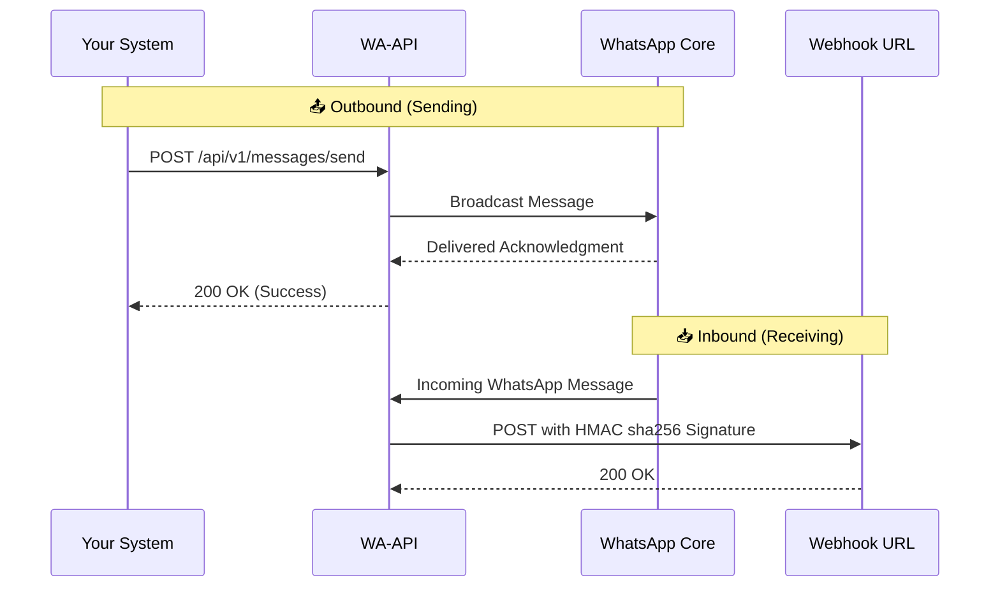

# 📱 wa-api: WhatsApp API & Webhook Layer

A robust, expressive, production-ready REST API and Webhook system for seamlessly sending and receiving WhatsApp messages.

---

## 🏗️ Architecture Flow



---

## ✨ Why `wa-api`?

- **⚡ Instant API Access**: Fire text messages to any WhatsApp number via a clean, authorized REST endpoint.
- **📡 Real-time Webhooks**: Get notified instantly when a message arrives via a secure webhook mechanism.
- **🔐 Flexible Auth**: Protect your API natively using either `Authorization: Bearer <API_KEY>` or `x-api-key: <API_KEY>`.
- **💻 Session Persistence**: Stop scanning QR codes daily. Employs `LocalAuth` to safely persist sessions locally across restarts.
- **🛡️ Production-Grade**: Layered architecture (Routes $\rightarrow$ Handlers $\rightarrow$ Services), global error tracking, `helmet` security, and signature validation.

---

## 📋 Prerequisites

Before you begin, ensure you have the following installed:
- **Node.js** (v22.x or higher recommended)
- **npm** (comes with Node.js)
- A smartphone with **WhatsApp** installed (to scan the initial QR code)

---

## 🚀 Installation & Setup

1. **Clone the repository**:
   ```bash
   git clone https://github.com/SupratimRK/wa-api
   cd wa-api
   ```

2. **Install dependencies**:
   ```bash
   npm install
   ```

3. **Configure Environment Variables**:
   Create a `.env.development` (or `.env.production`) file in the root directory:
   ```env
   PORT=5000
   API_KEY=your_super_secret_api_key
   WEBHOOK_URL=https://your-domain.com/webhook
   WEBHOOK_SECRET=your_super_secret_webhook_signature_key
   ```

4. **Start the server**:
   ```bash
   npm start
   ```

5. **Link your WhatsApp Account**:
   Upon starting, a **QR code** will be generated in your terminal. 
   - Open WhatsApp on your phone.
   - Go to **Settings** $\rightarrow$ **Linked Devices**.
   - Tap **Link a Device** and scan the QR code.

---

## 🔌 API Reference

### 1. Send a Message or Media
Dispatch a text message or media to a specific WhatsApp number.

**Endpoint:** `POST /api/v1/messages/send`

**Authentication Headers (Choose One):**
- `Authorization: Bearer <API_KEY>`
- `x-api-key: <API_KEY>`

**Request Options (`application/json` or `multipart/form-data`):**

| Field | Type | Required | Description |
| :--- | :--- | :--- | :--- |
| `number` | `string` | Yes | The recipient's phone number without `+` or spaces (e.g., `"1234567890"`). |
| `message` | `string` | No* | The text content or media caption. (*Required if no media is sent). |
| `mediaUrl` | `string` | No | (JSON) URL of a file to download and send (supports Images, PDFs, Videos, Documents, Audio). |
| `mediaBase64` | `string` | No | (JSON) Base64 encoded string of the file (e.g., `data:image/png;base64,...` or application/pdf). |
| `media` | `file` | No | (Form-Data) Direct file upload attachment (supports any WhatsApp compatible file type). |

**Example 1: Send Text Message (JSON)**
```bash
curl -X POST http://localhost:5000/api/v1/messages/send \
     -H "x-api-key: your_super_secret_api_key" \
     -H "Content-Type: application/json" \
     -d '{"number": "1234567890", "message": "Hello from secure API!"}'
```

**Example 2: Send Media via URL (JSON)**
Can be used to send PDFs, Videos, Audio, and Documents too, just provide a valid URL.
```bash
curl -X POST http://localhost:5000/api/v1/messages/send \
     -H "x-api-key: your_super_secret_api_key" \
     -H "Content-Type: application/json" \
     -d '{"number": "1234567890", "message": "Check out this document!", "mediaUrl": "https://example.com/invoice.pdf"}'
```

**Example 3: Send Local File (Form-Data)**
```bash
curl -X POST http://localhost:5000/api/v1/messages/send \
     -H "x-api-key: your_super_secret_api_key" \
     -F "number=1234567890" \
     -F "message=My cool photo" \
     -F "media=@/path/to/local/photo.jpg"
```

**Success Response (`200 OK`):**
```json
{
  "success": true,
  "message": "Message sent successfully",
  "chatId": "1234567890@c.us"
}
```

**Common Error Responses:**
- `400 Bad Request`: When `number` or `message` is missing, or the number is completely invalid on WhatsApp.
- `401 Unauthorized`: When the API key is missing or invalid.
- `404 Not Found`: When the target number is not registered on WhatsApp.

```json
{
  "error": "The phone number is not registered on WhatsApp."
}
```

---

## 📡 Webhook Integration

The application forwards incoming WhatsApp messages to your configured `WEBHOOK_URL` in real-time. 

### Webhook Payload Example

When a message is received, `wa-api` fires a `POST` request to your webhook with the following JSON structure. If it contains media, it automatically downloads and saves it to the local `uploads/` folder.

```json
{
  "id": "false_1234567890@c.us_3EB0...",
  "from": "1234567890",
  "body": "Hello there!",
  "timestamp": 1690000000,
  "hasMedia": true,
  "mediaUrl": "/uploads/1690000000-abcdef.png"
}
```

### 🔒 Accessing Protected Media
Downloaded media files inside `/uploads` are protected by your API key. **Do not pass the API key in the URL query parameters** as this compromises it in web server logs and browser histories. 

Retrieve the file securely by passing the API key in the headers:

```bash
curl -X GET http://localhost:5000/uploads/1690000000-abcdef.png \
     -H "x-api-key: your_super_secret_api_key" \
     --output downloaded_media.png
```

### 🛡️ Security: Signature Verification

To prevent unauthorized entities from spoofing alerts, every request includes a cryptographic **HMAC SHA256** signature. The signature is computed using your `WEBHOOK_SECRET` and attached via the `X-Webhook-Signature` header.

**Verification Example (Node.js/Express on your receiving server):**

```javascript
const crypto = require('crypto');

app.post('/webhook', express.text({ type: 'application/json' }), (req, res) => {
    const signatureHeader = req.headers['x-webhook-signature'];
    const payloadSignature = signatureHeader.replace('sha256=', '');

    const computedSignature = crypto
        .createHmac('sha256', process.env.WEBHOOK_SECRET)
        .update(req.body) // Note: Needs the raw request body string
        .digest('hex');

    if (computedSignature !== payloadSignature) {
        return res.status(401).send('Invalid webhook signature!');
    }

    const data = JSON.parse(req.body);
    console.log(`Received message from ${data.from}: ${data.body}`);
    res.sendStatus(200);
});
```

---

## 📂 Project Structure

```text
src/
├── app.js              # Express app setup & middleware
├── index.js            # Server entry & WhatsApp initialization
├── config/             # Environment variables
├── handlers/           # Request controllers
├── middlewares/        # Auth, Error handling, Security
├── routes/             # API routing limits
├── services/           # WhatsApp Client actions & Webhook dispatcher
└── whatsapp/           # Core WhatsApp instance configuration
```

---

## 🔒 Security Measures

- **Helmet.js Integration**: Auto-mitigates XSS, clickjacking, and mime-sniffing.
- **Strict API Key Validation**: Reject unauthorized network interactions instantly.
- **HMAC Signatures**: Total integrity and spoof-protection for outbound webhooks.

---

## 🎖️ Credits & Tech Stack

- **Runtime**: [Node.js](https://nodejs.org/)
- **Framework**: [Express.js](https://expressjs.com/)
- **Core Engine**: [whatsapp-web.js](https://docs.wwebjs.dev/)
- **Security**: [Helmet.js](https://helmetjs.github.io/)

---

## 📄 License

This project is open-sourced under the MIT License.
